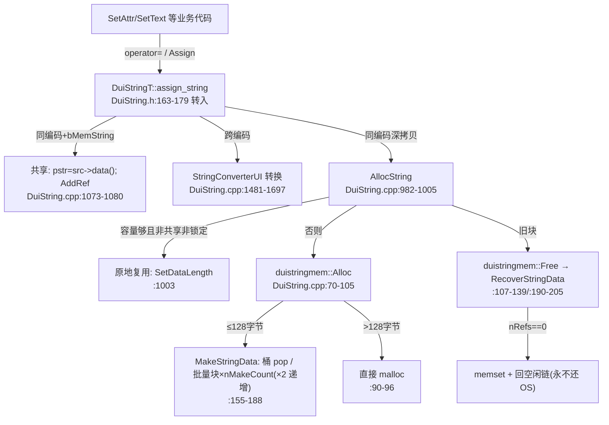

# DuiLib 字符串管理:引用计数头 + 四级尺寸类内存池

> 读者 assumed:熟悉 C++/Win32,不熟悉 DuiLib。所有行号基于 fork `refactor/extract-3rd`(f89c4f7)。
> 源码:`DuiLib/Utils/DuiString.h`(1137 行)、`DuiLib/Utils/DuiString.cpp`(1739 行)。

## 0. 一句话总览

DuiLib 没有使用 `std::string`,而是自带一套 **池化 + 引用计数共享** 的字符串体系:`CDuiString` 对象只持一个裸指针 `m_pstr`,指向一块头部内嵌引用计数的池内存;**同类型拷贝构造/赋值 = 共享缓冲 + 引用计数 +1**,写操作通过 `AllocString` 的 `IsShared()` 检查实现"写时分离"——但**有 4 条写路径绕过了该检查**,这是走读中最值得警惕的陷阱。

## 1. duistringdata:内嵌在数据前的引用计数头

`DuiLib/Utils/DuiString.cpp:9-39`:

```cpp
struct duistringdata : public ILinkedList
{
    REF_NUMBER nRefs;       // 引用次数(:13)
    int nDataLength;        // 已用长度(字节)(:14)
    UINT nAllocLength;      // 分配容量(字节),可大于实际长度(:15)
    ...
    LPBYTE data() { return LPBYTE(this+1); }   // (:38) 头部之后就是字符数据
};
```

关键语义(全部以 `nRefs` 一个字段表达,DuiString.cpp:29-32):

| 判定 | 条件 | 含义 |
|---|---|---|
| `IsNeedFree()` | `nRefs == 0` | 无人引用,可回池 |
| `IsShared()` | `nRefs > 1` | 多个对象共享,写前必须分离 |
| `IsLock()` | `nRefs < 0` | 锁定块(如空串),永不释放 |

`AddRef/ReleaseRef` 走原子操作(`:21/:27`);`UIATOMIC_*` 在 Win32 下映射到 `InterlockedIncrement/Decrement/CompareExchange/Exchange`(`DuiLib/Utils/Utils.h:649-652`,GCC 分支 `:655-658` 用 `__sync_*`)。`nRefs` 初始为 0(malloc 后 memset),`Alloc` 时 `AddRef` 变 1。

**没有析构函数、没有构造函数**——它只是一个 POD 前缀,`DuiStringMgr::GetStringData(pstr)` 用 `((duistringdata*)pstr) - 1`(DuiString.cpp:231-234)从任意字符指针反推头部。这就是整套机制的地址算术基础,也是所有陷阱的根源:任何持有裸 `LPCTSTR` 的地方都无法知道它背后是不是池内存。

## 2. duistringmem:四级尺寸类池 + 批量块翻倍分配

`DuiLib/Utils/DuiString.cpp:42-218`。单例内的分配器,核心成员(`:207-217`):

- `CDuiLock m_lock`(CRITICAL_SECTION 封装,Utils.h:989-999)
- `m_pEmptyString`:锁定的共享空串
- `m_listMem`:所有批量块的总账(进程退出前不归还 OS)
- `m_list16/32/64/128` + `m_nextCount16/32/64/128`:四条空闲链表 + 各自的"下批制造数"

### 2.1 分配:`Alloc(strlength)`(:70-105)

`strlength` 实际是**字节数**(含结尾 `\0`,见 §2.3 调用方)。落桶规则:

| 字节数 | 桶 | 初始批量数(`:47-50`) |
|---|---|---|
| ≤16 | m_list16 | 128 |
| ≤32 | m_list32 | 128 |
| ≤64 | m_list64 | 64 |
| ≤128 | m_list128 | 32 |
| >128 | **直接 `malloc`+`memset`(:90-96),不进池** | — |

桶空时的批量制造在 `MakeStringData`(:155-188):

```cpp
if(listdata.empty())
{
    int memsize = sizeof(duistringdata) + nAllocLength;
    BYTE *pBlock = (BYTE *)malloc(memsize * nMakeCount);  // 一次一块大内存(:160)
    ...
    for (i = 0; i < nMakeCount; i++)                      // 切成 nMakeCount 个条目入空闲链(:164-169)
    ...
    nMakeCount *= 2;                                      // (:171) 每批翻倍
}
return listdata.pop_back();
```

即:**首次需要某档时一次性 malloc 一大块,切成 128/128/64/32 个条目;之后每次该档耗尽,批量数翻倍**。申请到的条目 `SetDataLength + AddRef` 后返回(:101-102)。

### 2.2 释放与回收:`Free`(:107-139)/`RecoverStringData`(:190-205)

- 锁定块直接跳过(:109-110);空串块跳过(:112-115);
- ≤128 的按 `GetAllocLength()` 回到对应桶(:116-131);
- \>128 的 `ReleaseRef`,`nRefs==0` 时真正 `free`(:132-138)。

`RecoverStringData`(:190-205)是池回收的真正落点:`ReleaseRef → IsNeedFree → memset 清零数据区 → SetDataLength(0) → push_back 进空闲链`。

**块何时归还 OS:永远不会**(≤128 档)。回收只意味着"回到空闲链表复用";所有批量块都记在 `m_listMem`(:209),仅 `~duistringmem`(:57-67)在进程退出时统一 `free`。推论:**字符串内存水位只增不减,峰值即稳态**。对一个长期运行的启动器(mlaunch 场景)这通常无害(池条目固定上限 128 字节、可无限复用),但若用 DuiLib 写会瞬时构造大量长字符串的程序,需知道 >128 字节档是逐块 malloc/free、而 ≤128 档是"只还不退"。

### 2.3 容量按字节而非字符计

`AllocString`(W 版 :982-1005)`nNeedAlloc = (nStrLength + 1) * nSizeOfChar`(:985),即 **字节数**。所以对宽字符:16 字节桶只装得下 `7 个 wchar_t + \0`;32 字节桶 15 个字符。读代码时勿把桶号误当字符数。`SetDataLength(strlength)` 存的同样是字节;`GetBufferLength` 再除以 `sizeof(wchar_t)`(:1020-1024)。

## 3. DuiStringMgr 单例与空串

- `DuiStringMgr::GetInstance`(DuiString.cpp:221-229):函数级 `static duistringmem`,注释强调"确保在每个 string 构造之前构造,析构之后析构"——这是函数级 static 的构造时序保证,但**析构顺序**仍依赖静态析构逆序:若存在比它更晚析构的全局 `CDuiString`,退出时会访问已析构的池。mlaunch 无全局字符串对象,不触发。
- 锁定空串 `MakeEmptyString`(:146-153):malloc 16 字节 + `Lock()`(`nRefs=-1`)。所有默认构造的 `CDuiString` 构造即指向它(DuiString.h:157),析构时 `FreeString` 见 `IsLock` 直接跳过(DuiString.cpp:1012)。**所有空串共享同一块内存**——这是体系内唯一的"内容级共享"。

## 4. CDuiString = DuiStringT 模板

`DuiLib/Utils/DuiString.h:138-148` 定义三个具体类型与 `CDuiString` 别名:

```cpp
typedef DuiStringT<wchar_t, DuiStringTraitsW, duistring_encoding_unicode> CDuiStringW;  // :139
typedef DuiStringT<char,    DuiStringTraitsA, duistring_encoding_ansi>    CDuiStringA;   // :140
typedef DuiStringT<char,    DuiStringTraitsA, duistring_encoding_utf8>    CDuiStringUtf8;// :141
#ifdef _UNICODE
typedef CDuiStringW CDuiString;   // mlaunch 构建(UNICODE/_UNICODE,xmake.lua:32/113)走这里
#endif
```

`DuiStringT`(DuiString.h:154-846)只有一个成员 `uichar *m_pstr`(:845)。mlaunch 用的是 `CDuiStringW` 实例化,下文按它描述。

### 4.1 拷贝的真实语义:共享 + AddRef(不是深拷贝,也不是经典 COW)

类中三个"跨类型构造函数"(`:163-179`)各自与一个具体类型同型,因此对每个实例化而言,其中一个**就是它的拷贝构造函数**(typedef 展开后形参即 `const DuiStringT&`):

```cpp
DuiStringT(const CDuiStringW &str)      // 对 CDuiStringW 实例化,这就是拷贝构造(:175-179)
{
    m_pstr = DuiTraits::GetNullString();
    DuiTraits::assign_string(m_pstr, StringEncoding, str.toString(),
                             str.GetLength(), str.GetEncoding(), uiTrue);
}
```

`assign_string` 在**同编码 + `bMemString=uiTrue`** 时走共享分支(W 版 DuiString.cpp:1071-1080):

```cpp
duistringdata *src = DuiStringMgr::GetStringData(src_string);
FreeString(pstr);
pstr = (wchar_t *)src->data();
src->AddRef();                       // 引用计数 +1,两个对象指向同一块
```

同理,同类型赋值 `operator=(const CDuiStringW&)`(:427)也是 `Assign(..., uiTrue)` → 共享+AddRef。所以:

- **拷贝 = O(1) 共享引用计数**,不是逐字符分配(注意:这与初步印象"拷贝构造即分配"相反,`CopyFrom`(:280-284)才是显式深拷贝入口,平时不参与);
- **写时分离**:任何走 `AllocString` 的修改路径都会检查 `mem->IsShared() || mem->IsLock()`(W 版 :989),共享时新分配并把旧引用 `Free` 掉(:990-999,注释原文:"引用大于1,也要申请新的. 引用大于1时任何修改字符串都要自己建新的,不要把别人的改了")。`SetAt` 也先做同样检查(:1038-1049),`Empty` 共享时改为解引用回池(:1026-1036)。

这与经典 COW 的差别:分离点是**每个修改 API 显式检查**,而非统一的写代理;且只有部分 API 真正遵守(见 §5)。

### 4.2 无 intern 的实际含义

内容相同的两个 `CDuiString` 各占一块池条目;查找/比较全部走 `ui_strcmp`(值比较,如 `Compare` DuiString.h:516-521)。DuiLib 内部大量用字符串做 key(如 `m_mNameHash` 控件名表),意味着**同一个控件名会在 XML 属性解析、hash 表、控件对象里重复存多份**。池把分配成本摊薄了,但没有消除冗余存储。共享粒度只有三种:同对象引用计数、对象间拷贝共享(§4.1)、空串全库共享。

### 4.3 编码转换

三编码(ansi/unicode/utf8,DuiString.h:31-37)之间的转换集中在两处:

1. `assign_string/append_string` 的跨编码分支(A 版 DuiString.cpp:533-594,W 版 :1051-1114):不同编码时先过 `StringConverterUI` 转出临时串,再递归 `assign_string(..., uiFalse)` 做深拷贝。
2. `StringConverterUI`(DuiString.h:1064-1112,实现 DuiString.cpp:1481-1697):Win32 下 `A_to_W/W_to_A` 用 `m_cp`(默认 `CP_ACP`,:1486)+ `MultiByteToWideChar/WideCharToMultiByte`;`W_to_utf8/utf8_to_W` 固定 `CP_UTF8`(:1623-1662);`A_to_utf8/utf8_to_A` 经 wide 中转两跳(:1609-1621)。非 Win32 走 `SDL_iconv_string`(:1700-1735)。使用方式是作用域宏 `UISTRING_CONVERSION` + `UIA2T/UIW2T/...`(DuiString.h:1115-1132)。

两个值得记录的细节:

- **转换临时缓冲也吃字符串池**:`StringConverterUI::_block` 的 `Alloc/Release`(:1664-1697)就是 `DuiStringMgr` 的 `Alloc/Free`,且容量够用时复用同一块。即一次 UIA2W 的开销 = 一次池分配 + 一次 API 调用。
- **潜在长度单位错位**:`A_to_utf8(buffer, bufferlen)` 把 ansi 的**字节数**原样传给 `W_to_utf8(wstr, bufferlen)`(:1612-1613),后者按 `cchWideChar` 解释。`bufferlen=-1`(默认)无碍;显式传长度时中间那跳长度是错的。`utf8_to_A` 同理(:1619-1620)。上游遗留,暂无调用方踩中。

## 5. 复制陷阱:四条绕过 IsShared 的写路径(走读新发现)

`AllocString/SetAt/Empty` 守了"共享即分离"的规矩,但以下 API **直接写 `m_pstr` 指向的缓冲**,若该块正被别的对象共享,会**写穿到所有共享者**:

| API | 位置 | 行为 |
|---|---|---|
| `GetBuffer(n)` | DuiString.h:230-235 | 仅在容量不足时 `AllocString`(会分离);**容量够时直接返回共享指针**,调用方写入即污染共享者 |
| `MakeUpper/MakeLower` | DuiString.h:532-540 | 直接 `ui_strupr/ui_strlwr(m_pstr)` 原地转换,无任何检查 |
| `TrimLeft` | DuiString.cpp:1116-1128 | 造临时串后 `ui_strcpy(pstr, pNewString)` **写回原缓冲**,无共享检查 |
| `TrimRight` | DuiString.cpp:1130-1140 | 原地 `pstr[i] = L'\0'` 截断,无共享检查 |

复现链:`CDuiString a = _T("x"); CDuiString b = a; b.MakeUpper();` → a 同步变大写。另有一个自赋值怪癖:`s = s` 走共享分支前先 `FreeString`,引用计数 1→0 触发 `RecoverStringData` 的 memset,**内容被清空**(DuiString.cpp:1073-1079 与 :190-205 组合效应)。

工程结论(mlaunch 语境):把 `CDuiString` 当**不可变值**用(SetText/FindControl/拼属性串)时,这套共享机制只赚不赔;一旦养成对成员字符串做 `MakeUpper/Trim/GetBuffer` 的习惯,就埋下"改 A 动 B"的隐性 bug。跨线程同样:池本身有全局锁(分配/回收安全),但上述原地写路径对共享块没有任何同步,两个线程共享同一 `CDuiString` 值时 `MakeUpper` 就是数据竞争。DuiLib 的设计前提是**单 UI 线程**使用字符串,线程安全只做到"池级",不做到"对象级"。

## 6. 调用链速查



析构 `~DuiStringT`(DuiString.h:211-214)→ `FreeString`(:1007-1018):非锁定块 `Free` 后把 `m_pstr` 复位到共享空串——即使悬空使用也只会读到空串,这是该设计对野指针的最后一道缓冲。
