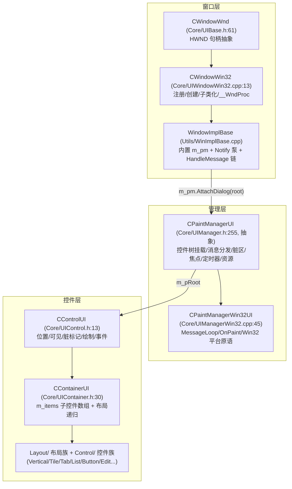
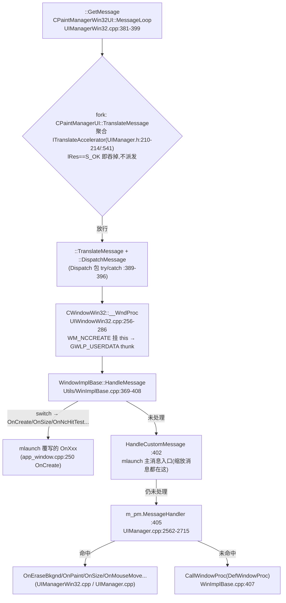

# DuiLib UI 架构与消息循环:控制树、CPaintManagerUI、事件/通知、XML 皮肤 vs 全代码建树

> 行号基于 fork `refactor/extract-3rd`(f89c4f7)。mlaunch 侧代码为 feature/tools-plugin 工作区现状。

## 1. 类层次总览

## 2. 控制树:CControlUI / CContainerUI

**CControlUI**(`Core/UIControl.h:13`,继承 `CUIAnimation`;实现 `Core/UIControl.cpp` 共 2187 行)是所有控件的基类,每个控件同时知道:

- 自己的矩形 `m_rcItem` 与脏标记 `m_bUpdateNeeded`(:483);
- 所属管理器 `m_pManager` 与父控件(`SetManager`,:29);
- 绘制流水线:`Paint`(:1704 实现,裁剪判定后进 `DoPaint` :1721)→ 固定顺序 `PaintBkColor→PaintBkImage→PaintStatusImage→PaintForeColor→PaintForeImage→PaintText→PaintBorder`(:1747-1753);
- 事件入口 `Event/DoEvent`(:438-439)。

**关键方法 `SetPos`**(UIControl.cpp:567-603)是整个布局/重绘体系的枢纽:

1. 写 `m_rcItem = rc`(:575),回调 `OnSize`(:578-585);
2. 清自身脏标记(:587);
3. `bNeedInvalidate` 时把**旧矩形与新矩形的并集**向上按可见父矩形逐级裁剪(:589-602),最后 `m_pManager->Invalidate(invalidateRc)`。

**CContainerUI**(`Core/UIContainer.h:30`,`CControlUI + IContainerUI`)用 `CStdPtrArray m_items`(:127)持有子控件。它的 `SetPos`(UIContainer.cpp)是**递归布局**入口:先 `CControlUI::SetPos` 自身,再按 inset/滚动条偏移收缩可用区,然后遍历 `m_items`——float 子件走 `SetFloatPos`,其余 `pControl->SetPos(rcCtrl, false)` 向下递归。具体排布策略在 `Layout/` 目录的布局类(Vertical/Horizontal/Tile/Table/Tab 等)中,`fixed`/`pct` 等属性决定子件占位。注意 `SetPos(rc, false)` 传 false 时不逐个失效——**全树重排后由上层一次性失效整窗**(这正是 03 篇 OnPaint 重排分支 `rcPaint = rcClient` 的原因之一)。

**脏标记语义**(UIControl.cpp:1041-1090):

- `NeedUpdate()`(:1069):`if(!IsVisible()) return;` —— **不可见控件标脏直接丢弃**(fork KNOWN_ISSUES #3,待修),宿主显隐切换后必须手工 `GetRoot()->NeedUpdate()`;
- `NeedUpdate()` 同时 `Invalidate()`(自矩形,向上裁剪)并 `m_pManager->NeedUpdate()`(把 `m_bUpdateNeeded` 置位,UIManager.cpp:721-724);
- `Invalidate()`(:1041):不可见早退;自矩形沿父链求交后交给 manager。

## 3. CPaintManagerUI:每个窗口一个"大管家"

`Core/UIManager.h:255` 起的抽象类(实现集中在 3348 行的 `Core/UIManager.cpp`),Win32 侧具体类 `CPaintManagerWin32UI`(`Core/UIManagerWin32.cpp:45`)。一个顶层 HWND 对应一个实例(mlaunch 中即 `WindowImplBase` 的 `m_pm` 成员)。职责清单(成员见 UIManager.h:630-708):

| 职责 | 关键成员/入口 | 位置 |
|---|---|---|
| 控件树挂载 | `AttachDialog`(建阴影窗口、延迟清理旧树、`InitControls` 递归 SetManager + 建名字 hash) | UIManager.cpp:755-790 |
| 控件回收 | `ReapObjects`(清焦点/定时器/异步通知悬挂指针) | UIManager.cpp:792-807 |
| 全局脏区 | `m_bUpdateNeeded` + `NeedUpdate/LockUpdate/IsLockUpdate` | UIManager.cpp:716-734 |
| 失效 | `Invalidate()` 整窗 / `Invalidate(rc)` 局部(Union 进 `m_rcLayeredUpdate`) | UIManager.cpp:735-753 |
| 焦点/悬停 | `m_pFocus/m_pEventHover/m_pEventClick`、`SetFocus`、Tab 轮换 | UIManager.h:644-649 |
| 定时器 | `SetTimer/KillTimer`(Win32 `::SetTimer` 轮转 ID) | UIManagerWin32.cpp:236-249 |
| tooltip | `m_hwndTooltip`,`OnMouseOver` 内创建/激活 | UIManagerWin32.cpp:690-713 |
| 渲染引擎 | `Render()` 惰性创建 `UIGlobal::CreateRenderTarget()` | UIManagerWin32.cpp:122-131 |
| 阴影窗口 | `m_shadow`,`AttachDialog` 时 `Create`,首帧/尺寸后 `Update` | UIManager.cpp:759、UIManagerWin32.cpp:518 |
| 资源 | `m_ResInfo` + 静态 `m_SharedResInfo`(字体/图片/样式表,可跨窗口共享) | UIManager.h:699/:720 |
| 异步通知 | `m_aAsyncNotify` + `WM_APP+1` 泵 | UIManager.h:690、UIManager.cpp:2717-2740 |
| DPI | `m_pDPI`(SetDPI/ScaleRect,控件尺寸按 DPI 缩放) | UIManager.h:705 |

静态侧还有 `m_aPreMessages`(UIManager.h:726)登记全部活跃 manager,支撑 `GetPaintManager(名字)`、`SetAllDPI`、`ReloadSkin` 等跨窗口操作。

## 4. 消息从 Win32 到控件:完整调用链

以 mlaunch 主窗口为例(实际路径,全部核实过):

`CPaintManagerUI::MessageHandler`(UIManager.cpp:2562-2715)分发前的两道前置:

1. **消息过滤器** `m_aMessageFilters`(:2566-2593):`IMessageFilterUI` 链(UIManager.h:193-197),`bHandled` 即截断;另有 `m_aPreMessageFilters` 在 `PreMessageHandler`(:2498-2560)处理 VK_TAB 轮换、ALT 快捷键、SYSKEY——注意它在**窗口过程之前**(由 fork 的 `TranslateMessage` 聚合器内调用),mlaunch 的 SettingsWindow TAB 捕获就是被它逼到用 `ITranslateAccelerator` 解决(KNOWN_ISSUES #10)。
2. **layered 分支**(:2595-2611)拦截 `WM_NCCALCSIZE/WM_NCPAINT`。

随后 switch 到各 `OnXxx`。对渲染/交互最关键的三个:

- **WM_ERASEBKGND**(:2621-2628):`lRes=1` 直接返回——框架声明"背景由我画",配合窗口类 `hbrBackground=NULL`(UIWindowWin32.cpp:227)构成防闪烁设计;
- **WM_PAINT** → `CPaintManagerWin32UI::OnPaint`(UIManagerWin32.cpp:432-618),见 03 篇;
- **WM_SIZE** → `OnSize`(UIManager.cpp:2742-2754):给焦点控件发 `UIEVENT_WINDOWSIZE` 事件 + `m_pRoot->NeedUpdate()`(只标脏,不立即重排)。

鼠标路径(`OnMouseMove`,UIManagerWin32.cpp:740-802):`_TrackMouseEvent` 登记 HOVER/LEAVE(:743-751),用 `FindControl(pt)`(走 `__FindControlFromPoint` 回调递归命中,UIManager.h:586)找新悬停控件,人工合成 `UIEVENT_MOUSEENTER/LEAVE`(:768-788)——DuiLib 控件没有 HWND,"进入/离开"全靠 manager 对比 `m_pEventHover`。

**fork 死代码警告**:mlaunch 的 AppWindow 同时覆写了 `MessageHandler(UINT,...,bool&)`(app_window.h:40),但那是 `WindowImplBase::MessageHandler`(`IMessageFilterUI` 版,WinImplBase.cpp:64 起)——它**永远不会被调用**(KNOWN_ISSUES #14)。真正入口是 `HandleCustomMessage`(:410 空默认实现,mlaunch 于 app_window_interaction.cpp 覆写)。

## 5. 事件(TEventUI)与通知(TNotifyUI):两套体系

| | TEventUI | TNotifyUI |
|---|---|---|
| 定义 | UIManager.h:165-175 | UIDefine.h:72-81 |
| 内容 | Type(UIEVENT_*)/ptMouse/chKey/wKeyState | sType(字符串,如 "click")/pSender/wParam |
| 方向 | 系统输入 → manager → **分发给具体控件** | 控件 → **上抛给监听者** |
| 消费者 | `CControlUI::Event`(UIControl.cpp:1114)→ 各控件 `DoEvent` 虚函数 | `INotifyUI::Notify`(UIManager.h:186-190)监听者列表 |
| 典型值 | UIEVENT_BUTTONDOWN/MOUSEMOVE/KEYDOWN/SETFOCUS/TIMER(UIManager.h:23-52) | DUI_MSGTYPE_CLICK/ WINDOWINIT / WINDOWSIZE 等 |

**通知发送** `SendNotify`(UIManager.cpp:1333-1378):同步路径直接回调 `pSender->OnNotify` 回调 + 遍历 `m_aNotifiers`(先控件自身协议、再外部监听者,:1352-1362);异步路径 new 一份 `TNotifyUI` 入 `m_aAsyncNotify` 并 `PostAsyncNotify` 投递 `WM_APP+1`(:1363-1377),消息回来后在 `OnApp1` 中排队清空并逐个派发(:2717-2740)——这是跨线程操作 UI 的官方通道(同文件 :232-250 的 `TUIAction/UIAction` 是另一组跨线程动作宏)。

mlaunch 的接法:`AppWindow::OnCreate` 里 `m_pm.AttachDialog(root); m_pm.AddNotifier(this);`(app_window.cpp:273-274),`AppWindow::Notify` 覆写(app_window.h:45)按 `msg.pSender->GetName()` 分发,再经 `WindowImplBase::Notify → CNotifyPump::NotifyPump`(WinImplBase.cpp:447-450)支持消息映射表(`DuiMessageMapFunctions`,UIDefine.h:83-86)。

## 6. 布局体系小结(SetPos 何时发生)

- 一次性标脏:`CControlUI::NeedUpdate / NeedParentUpdate`(UIControl.cpp:1069-1090);
- 真正的重排只发生在 `OnPaint` 里发现 `m_bUpdateNeeded` 时:`m_pRoot->SetPos(rcClient, true)` 自顶向下递归(UIManagerWin32.cpp:484),或部分更新分支对"被标的控件"逐个 `SetPos(旧矩形)`(:490-504,KNOWN_ISSUES #4:按陈旧 `m_rcItem` 画,有隐患,mlaunch 统一走整树重排规避);
- 控件几何改动(`Move/SetFixedWidth/...`)普遍只标脏不立即重排——**DuiLib 的布局是"拉"模型:绘制时刻集中重排**。

## 7. 皮肤 XML(UIDlgBuilder + pugixml)vs mlaunch 全代码建树

### 7.1 DuiLib 的 XML 路径

`CDialogBuilder`(`Core/UIDlgBuilder.cpp`,483 行):`Create(STRINGorID,...)`(:10-51)支持 **XML 字符串(以 `<` 开头)/ 磁盘文件 / 资源 ID / zip 包** 四种来源,经 `m_xml.load_string / load_buffer`(:25-44)进 pugixml(pugixml 以 header-only 方式编入每个 TU,见 `DuiLib/StdAfx.h:82-86`);随后 `Create(...)` 扫根节点资源/字体声明(:53-327),`_Parse`(:330-428)递归:按节点名 `CControlFactory` 建控件、`GetInterface` 补齐接口、逐属性 `SetAttribute`,遇容器递归 `_Parse`(:425),未知类回调宿主 `IDialogBuilderCallback::Create`。控件类的注册依赖 `DECLARE_DUICONTROL` 宏(UIControl.h:15)。

配套的 `CResourceManager`(Core/UIResourceManager.cpp)提供语言包/多皮肤路径解析。

### 7.2 mlaunch 的全代码建树

mlaunch **完全不走 XML**:`GetSkinFile()` 返回空串(app_window.h:26),控件树在 `UiBuilder::BuildRootUi()`(src/ui/ui_builder.cpp:12-200)用 `new CVerticalLayoutUI()/CHorizontalLayoutUI()/appui::XXX` 直接拼装,样式用 `SetAttribute(_T("bkcolor"), ...)` 逐个设(与 XML 属性同名,复用了库的属性解析器),SVG 图标由 `IconManager::MakeSvgImageAttr` 生成绘制属性串注入。`AppWindow::OnCreate`(app_window.cpp:250-313)随后 `m_pm.Init → AttachDialog → AddNotifier → FindControl(名字)` 取回各控件指针存成员。构建时 `DuiLibLite` 目标也无需排除 pugixml.cpp(xmake.lua:38 注释:迁移后 3rd/ 不在 glob 内)。

| | XML 皮肤(库默认) | 全代码(mlaunch) |
|---|---|---|
| 布局来源 | 运行时解析,可换肤/热更/配 DuiEditor 所见即所得 | 编译期固定,重构靠 IDE |
| 错误发现 | 运行时(属性拼错静默失效,KNOWN_ISSUES #12 即此类) | 编译期(名字/类型 checked) |
| 资源打包 | 需要 res 目录/zip/资源段 | 不需要 |
| 与 pugixml | 强依赖 | 依赖仍在(TU 内联),仅运行时不用 |

两种模式对 DuiLib 而言共用同一棵控件树与绘制管线,差异只在"树怎么长出来"。

## 8. 给不熟悉 DuiLib 的工程师的三个提醒

1. **不要覆写 `WindowImplBase::MessageHandler`**,覆写 `HandleCustomMessage`(mlaunch 全部缩放/自定义消息在此,app_window_interaction.cpp)或 `OnXxx` 虚函数。
2. **拦截原生 EDIT 子窗口按键**只能用 fork 的 `ITranslateAccelerator`(`m_pm.AddTranslateAccelerator(this)`,app_window.cpp:260);返回 `S_OK` 会吞掉消息、`S_FALSE` 放行,且回调对**所有**经过循环的消息触发(KNOWN_ISSUES #6)。
3. 控件显隐/几何改动后记得 `GetRoot()->NeedUpdate()`——`NeedUpdate()` 对不可见控件早退(#3),部分更新路径按旧矩形画(#4),宿主统一整树重排是最稳路径。
