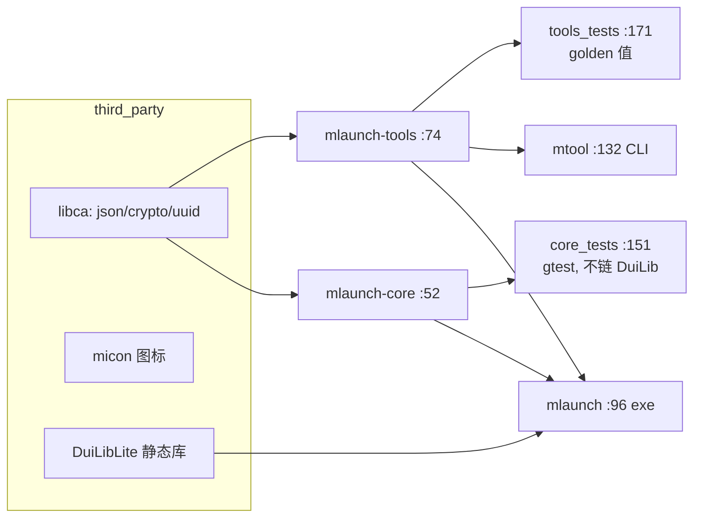

# mlaunch 架构简篇(模块结构、与 DuiLib submodule 的结合、构建与测试)

> 2026-09-09。行号基于 feature/tools-plugin 工作区。DuiLib 侧的深入走读见
> `docs/duilib-architecture/01~04`。本文是 `docs/architecture.md`(职责拆分记录)的补充,
> 侧重仓库级结构、构建与依赖边界。

## 1. 模块结构与代码量

一方代码(src+tests+tools)约 1.22 万行:

| 目录 | 行数 | 内容 | 依赖边界 |
|---|---|---|---|
| `src/core/`(+`utils/`) | 2,432 | 纯 CRUD 核心:`launcher_core`(数据模型/分组/项目)、`launcher_core_persistence`(JSON 持久化+备份轮转+journal)、`launcher_core_launch`(启动执行)、`logger`、`utils/string_util`(UTF-8/Wide 转换) | **零 DuiLib/shell32**,可独立单测 |
| `src/tools/` | 1,244 | 小工具插件层:base64/hash/uuid/timestamp/url/sine/font,`tool_registry` 纯函数注册表 | 仅 libca;font 工具用 GDI |
| `src/ui/` | ~6,930 | DuiLib 界面层,按职责拆分(见 §2) | DuiLib + core + tools + shell32/dwmapi |
| `tests/` | ~1,550 | `core_tests.cpp`(1,120 行,gtest,不链 DuiLib)、`tools_tests.cpp`(400 行,golden 值+`sine_golden.inc`) | gtest |
| `tools/` | — | `mtool_main.cpp`(CLI 入口)+ PowerShell 证据脚本(shot/drag/scan_bands/scan_windows 等,UI 像素取证用) | — |

## 2. src/ui 内部拆分(AppWindow 的职责下沉)

- `app_window.h:24` — `AppWindow : DuiLib::WindowImplBase, private DuiLib::ITranslateAccelerator`,持有 `m_pm`(PaintManager)与各控制器;
- `app_window_lifecycle.cpp` — `OnCreate`(app_window.cpp:250-313:`AlignDpi → m_pm.Init → AddTranslateAccelerator → BuildRootUi → AttachDialog → AddNotifier → FindControl 取回控件指针 → LoadBackendData → RestoreUiState`)、窗口布局持久化(INI 读写,注意 `WritePrivateProfileStringW(nullptr,nullptr,nullptr)` 冲刷句柄缓存的细节,app_window_lifecycle.cpp:81-83 附近);
- `app_window_interaction.cpp`(707 行)— `HandleCustomMessage` 主消息入口:拖拽排序、锁布局 `OnNcHitTest`、**缩放消息(WM_ENTERSIZEMOVE :490-493 / WM_EXITSIZEMOVE :495-505 / WM_SIZE :507-512,详见 duilib-architecture/03 篇)**;
- `app_window_menus.cpp`(1,017 行)— 右键菜单/命令分发;
- `ui_builder.cpp`(200 行)— 全代码控件树(`BuildRootUi`,不走 XML 皮肤,`GetSkinFile()` 返回空,app_window.h:26);
- `list_controller / search_controller / dialog_manager / icon_manager / status_presenter / file_icon_control / dpi_helper / edit_focus_helper / ui_controls / shell_services` — 列表渲染、搜索模式、对话框、SVG 图标解析与缓存、Toast、文件图标、DPI 对齐、原生 EDIT 焦点协调、自绘控件族、shell 服务实现。

## 3. 与 DuiLib 的结合方式

- **git submodule 源码编译**,非预编译库:`third_party/DuiLib_DuiEditor` 检出 fork 分支 `refactor/extract-3rd`,当前钉在 `f89c4f7`;另有 `third_party/libca`、`third_party/micon`。
- 根 `xmake.lua:19` `duilib_dir = "third_party/DuiLib_DuiEditor/DuiLib"`,目标 `DuiLibLite`(:21-48):static、glob `**.cpp`,`remove_files` 排除 unzip/UIDataExchange/Gtk/`*Sdl*`/Cairo 系列(:35-48,排除清单与 fork 根 xmake.lua 同步维护;pugixml.cpp 已随 3rd/ 迁移天然不在 glob 内,:38 注释);宏 `UNICODE/_UNICODE/UILIB_STATIC`(:32)。
- fork 相对上游的 6 个提交 = 渲染两修复(c329337)+ 工程化(xmake/CI/KNOWN_ISSUES)+ 三次 3rd/ 迁移 + 登记表;fork 专有扩展 `ITranslateAccelerator` 被 mlaunch 两个窗口使用(注册点 app_window.cpp:260;`S_OK` 吞消息约定见 duilib-architecture/02 篇)。
- mlaunch 对 fork 的依赖面:`WindowImplBase`/`CPaintManagerWin32UI`、GDI 渲染后端、控件族、nanosvg+stb(SVG 图标);pugixml 被编入但运行时不用(无 XML 皮肤)。

## 4. xmake 目标图

- `mlaunch` 目标 syslinks(:123):user32/gdi32/comctl32/ole32/dwmapi/shell32/… ;Debug 定义 `MLAUNCH_DEV_CONSOLE`(:107)控制台输出,`main.cpp:70` 附近完成 `CoInitialize + CPaintManagerUI::SetInstance/SetCurrentPath/SetResourcePath`(在创建窗口**前**捕获 CWD,因 DuiLib 的 SetCurrentPath 会改进程 CWD,旧版数据发现依赖启动目录)。
- `core_tests` 注入 fake 执行器,不依赖 UI;`tools_tests` 用 golden 值校验纯函数。

## 5. tests 布局与验证链

- `tests/core_tests.cpp`(1,120 行):数据模型 CRUD、持久化往返/损坏恢复、备份轮转、journal;
- `tests/tools_tests.cpp`(400 行):各工具 golden 值 + 往返一致性;font 工具走真实 GDI(需 gdi32);
- CI(`.github/workflows/build.yml`):push(main)/PR → windows-latest × {release,debug},checkout `submodules: true`,xmake 构建后 `xmake run core_tests` 并上传 exe;
- 端到端回归链:改 mlaunch → push 触发 CI(submodule 源码编译新 DuiLib);改 DuiLib fork → 其自身四矩阵 CI(static/shared × release/debug)编译验证 → mlaunch 侧 bump submodule 后再过 CI。

## 6. 仓库现状注意项(2026-09-09,只读核实)

- 工作区存在未提交改动(含 `.github/workflows/build.yml` 的 format job 缩进错误:被插在 `on:` 键下、与 `push:` 同级,按现状推送会使整个 workflow 无效);T3-B 正在处理,集成时注意甄别归属,勿裹挟无关 WIP。
- 已有文档分工:`dev_plan.md`(批次史,含 B1 缩放去闪烁第一轮修复)、`docs/architecture.md`(职责拆分)、`docs/ui_flow.md`、`docs/HANDOVER.md`(fork 坑清单)、本文与 `docs/duilib-architecture/`(DuiLib 机制走读)。
